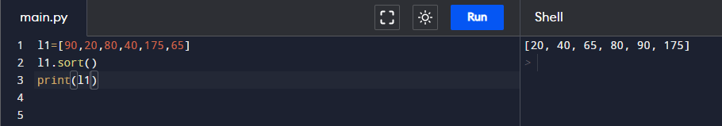

# Assignment - 14 Full Stack Web Development using Python MySirG More on List

    Qns 1. Write a Python script to create a list of first N natural numbers.

    Ans.

    Qns 2. Write a Python script to create a list of first N odd natural numbers.

    Ans.

    Qns 3. Write a Python script to create a list of first N even natural numbers.

    Ans.

    Qns 4. Write a Python script to find the greatest number in a given list of numbers.

    Ans.

    Qns 5. Write a Python script to find the smallest number in a given list of numbers.

    Ans.

    Qns 6. Write a Python script to calculate the sum of elements in a given list of numbers.

    Ans. 

    Qns 7. Write a Python script to remove all non int values from a list.

    Ans.

    Qns 8. Write a Python script to print distinct elements along with their frequencies of occurrence in the list.

    Ans.

    Qns 9. Write a Python script to print indices of all occurrences of a given element in a given list.

    Ans.

    Qns 10. Write a python script to sort a list.

    Ans.
